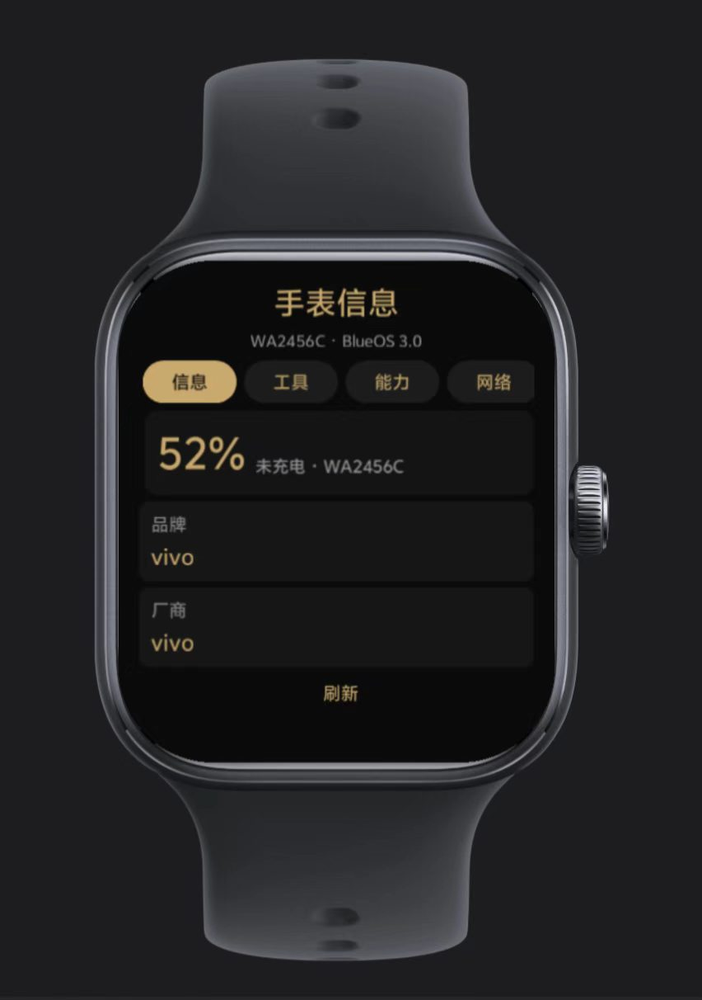

# 手表信息 · BlueOS Watch App

**vivo / iQOO 蓝河（BlueOS）手表应用** —— 设备信息 + 实用工具 + 能力诊断

实测机型：**iQOO WATCH GT**（`WA2456C` / BlueOS 3.0） · 当前版本：**v4.1.0** · 包名：`com.dz6g.watchinfo`

---

## 📸 截图

**信息页** —— 电量大字（含充电状态）+ 设备信息，整页可滚动



> 工具页 / 能力页 / 网络页 截图待补充（`docs/images/02-tools.png`、`03-capability.png`、`04-network.png`）

## 功能

| 标签 | 内容 |
|---|---|
| **信息** | 电量大字（含充电状态）、品牌 / 型号 / 系统版本 / 屏幕 / 刷新率 / 语言 / 地区、当前屏幕亮度 |
| **工具** | 振动（短振 / 长振 / 两下）、屏幕常亮开关、一键调暗 |
| **能力** | 本机型的**实测能力报告**（✅ 能用 / ⛔ 未开放，每条注明原因）|
| **网络** | 连通性诊断（一键测试多个地址，记录哪些通、哪些不通）|

- 版式按 **466 设计宽度**的圆屏适配，黑金配色
- 所有取值都有兜底：**任何接口取不到只显示「取不到」，不会崩溃**
- 11 个官方模块全部静态引入（产物内 18 个 `@app-module/*` 引用）

## 安装（侧载）

1. 下载 [`dist/com.dz6g.watchinfo.debug.4.1.0.rpk`](dist)
2. 用社区侧载工具（如**蓝盒助手**）导入并安装到手表
3. 机型限制：vivo / iQOO **WATCH GT**、**WATCH 3** 系列（初代 / 二代 / 五代不支持侧载）

---

## ⭐ 这块表到底能做什么（真机实测结论）

### ✅ 有真数据

| 能力 | 接口 | 实测返回 |
|---|---|---|
| 设备信息 | `deviceInfo.getInfoSync()` | `{"brand":"vivo","manufacturer":"vivo","model":"WA2456C","product":"5","osType":"BlueOS","osVersionName":"3.0",...}` |
| 电量 | `battery.getStatus()` | `{level: 0.55, charging: false}`（level 是 0~1 小数）|
| 屏幕亮度 | `brightness.getValue()` / `setValue()` | 可读可设 |
| 振动 | `vibrator.vibrate({mode})` | 可振动 |
| 模块加载 | 静态 `import` | 11 / 11 全部加载成功 |

### ⛔ 系统不给（接口在，但没有数据）

| 能力 | 现象 |
|---|---|
| **蓝牙扫描结果** | `startDevicesDiscovery` / `stopDevicesDiscovery` 可调用，但 `onDeviceFound` / `onDevicefound` / `onDeviceFind` / `onDevicefind` **四种大小写回调属性全不存在** → 收不到任何设备；`getBondedDevices` / `getLocalName` / `getState` / `isEnabled` 也不存在 |
| **传感器数据流** | 6 个 `subscribe*`（计步 / 加速度 / 指南针 / 气压 / 抬腕 / 陀螺仪）**接口都在**，但 **7 种订阅姿势**（`{success}` / `{callback}` / `{onChange}` / 位置参数 / `{onStepChange}` / health 两种）**零数据回传** |
| 健康统计 | `health.getTodayStatistic()` → `undefined` |
| 存储容量 | `statvfs.getTotalSize/getFreeSize` → `0` / `undefined`（桩）|
| 网络类型 | `network.getType()` → 无返回 |
| 佩戴状态 | `sensor.getOnBodyState()` → `undefined` |
| 蓝牙设备信息 | 该机型不向第三方应用回传扫描结果与已配对列表（社区成品应用 [bluex](https://github.com/Nocool101/blueOS-X) 作者同样撞墙，最后硬编码了演示数据）|

### 🌐 网络（关键结论）

`fetch`（`@blueos.network.fetch`）**能连通 `https://api.github.com`**（HTTP 200 有返回），
但**连不上 `dz6g.ccwu.cc`** —— 对照测试全部失败：`https` / `http` 明文 / 带 `%5B` 查询参数 / 真实 API / 100KB 大响应 / 直连公网 IP。
**不是 TLS / DNS / 响应大小的问题，是这台表的网络通路只对部分地址开放。**

> 旁证：vivo 官方手表商店里有款「愛AI」（接 DeepSeek API，适配 WATCH 3 / WATCH GT，2.1 万下载），
> 说明 **HTTPS + POST 调外部 API 是可行的**，手表上也有文字输入能力。

### 🔍 一条重要规律

> **回调式 API（`{success, fail}`）在本机型一律不回；只有「直接返回式」能出数据。**

`getInfoSync()` ✅ ／ `getInfo({success})` ❌ ／ `battery.getStatus()` ✅ ／ `subscribeStepCounter({success})` ❌

---

## 在 Linux 上构建（不需要 Windows / macOS）

官方 IDE **BlueOS Studio 只有 macOS / Windows 版**，但它内部是纯 Node 工具链 + 官方自带的 **Linux 原生二进制**，可以掏出来直接用。

```bash
# 1) 从官方 macOS dmg（7z 可解）掏出工具链
#    详见 tools/TOOLCHAIN.md
# 2) 打包
cd app
/root/blueos/bin/jax build        # → dist/watch-round/debug/com.dz6g.watchinfo.debug.<版本>.rpk
```

产物结构（与官方 IDE 出包**逐项一致**）：

```
META-INF/CERT         签名（debug 用内置签名，release 需自备证书）
logo.vug              图标（vivo 自有格式）
manifest.json         配置（明文）
com.dz6g.watchinfo.vru  应用本体（文件头 "vivo union file"，内含明文 JS）
META-INF/build.txt    工具链信息（toolkit=1.0.12-beta.13 / platform=linux）
```

**出包速度约 3~4 秒。**

### ⚠️ 两个必踩的坑

1. **`jax build` 编译报错也会照常产出 rpk** —— 必须检查日志里的 `[ERROR]`，否则会把坏包发出去。
   （`tools/build.sh` 里已内置这道检查 + `<script>` 段 `node --check` 预检。）
2. **动态加载模块必失败** —— `$app_require$('@app-module/' + name)`（运行时拼名字）在真机上取不到模块；
   **必须静态 `import`**，编译后会自动映射成 `@app-module/system.xxx`。

---

## 版本历史

| 版本 | 做了什么 | 结果 |
|---|---|---|
| v1.0 | 「蓝牙信息查看器」首版：本机 / 扫描 / 探针三页 | 扫描能启动但收不到结果 → 发现回调缺失 |
| v1.1 | 自适应版：四种枚举法 + 候选接口逐个实测 | 确认模块是**原生对象**（无原型、`Object.keys` 为空）|
| v1.2 | 候选接口全实测 + `$app_require$` 试加载老模块 | 定位 `getInfoSync()` 是本机唯一可用取法 |
| v1.3 | 照抄社区成品应用的蓝牙写法重写 | 扫描仍 0 结果 → 确认系统不回传 |
| v2.0 | 升级为「手表信息」：系统 / 设备 / 蓝牙 | ⚠️ 改动态加载模块 → 全部「模块加载失败」|
| v2.1–2.2 | 改回静态 import + 增加诊断页 | **9 / 9 模块加载成功** |
| v2.3 | 计步大数字 + 6 种订阅姿势 | 订阅回调零数据 |
| v2.4 | 计步 **7 种姿势**全试 | 0 次数据 → 传感器数据流关闭 |
| v3.0–3.4 | 联网诊断（9 项对照实验）| **只有 GitHub 通**，本站全不通 |
| **v4.0** | 完整版：信息 / 工具 / 能力 / 网络 + 新图标 | 交付 |
| **v4.1** | 修 UI：电量卡改为随列表滚动，不再遮挡信息 | 交付 |

> 说明：早期版本的源码在迭代中被覆盖、产物已在重建时清理，因此仓库只保留**最终版源码 + 成品**，
> 上面这张表完整记录了每个版本做了什么、得到什么结论。

## 项目结构

```
app/                     BlueOS 工程源码
├── package.json
└── src/
    ├── manifest.json    配置：features / permissions / router
    ├── app.ux           应用级（空实现）
    ├── assets/images/logo.png
    └── pages/Home/index.ux   全部界面逻辑（四个标签）
dist/                    成品 rpk
docs/                    截图与补充文档
tools/
├── build.sh             一键构建（含报错检查）
└── TOOLCHAIN.md         工具链获取方法
```

## 参考

- 官方文档：<https://developers-watch.vivo.com.cn>
- 社区成品应用（蓝牙写法参考）：[Nocool101/blueOS-X](https://github.com/Nocool101/blueOS-X)
- 官方手表商店应用「愛AI」（DeepSeek）——证明手表可调外部 API

---

*本项目的所有结论均来自真机实测（iQOO WATCH GT / WA2456C / BlueOS 3.0），未经验证的推测在文中已明确标注。*
